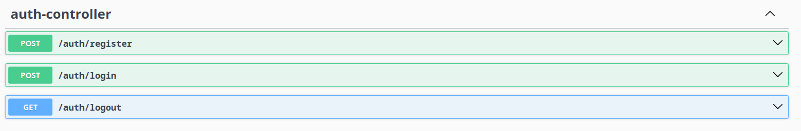
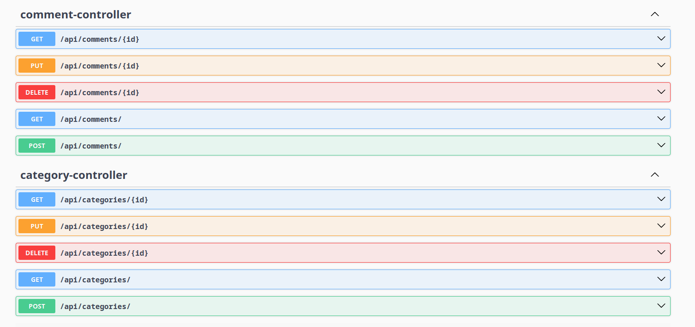
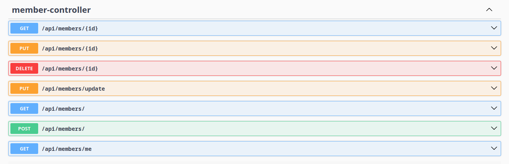
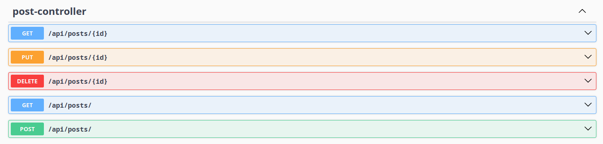

# CommunityAPI

**Description:**
This is the backend API for a community application. It provides the core functionalities for user authentication, member management, category management, post creation, and commenting.

**Technologies Used:**
* **Database:** PostgreSQL
* **Framework:** Spring Boot
* **Caching:** Redis

**Controllers:**

* **Auth:** Handles user registration, login, logout, and JWT token generation and invalidation using Redis.
* **Member:** Manages user profiles and settings.
* **Category:** Allows authorized users to create and modify categories.
* **Post:** Enables users to create, edit, and delete posts within specific categories.
* **Comment:** Facilitates commenting on posts and managing comment replies.

**Key Functionalities:**

* **User Authentication:** Secure user registration, login processes, and JWT-based authentication with token blacklisting in Redis.
* **Member Profiles:** Users can create and manage their profiles.
* **Category Management:** Admins can create and manage categories.
* **Post Creation and Management:** Users can create, edit, and delete their posts.
* **Commenting System:** Users can comment on posts and reply to comments.

**Usage:**

Swagger Screenshots

**License:**

This project is licensed under the MIT License.